# Step By Step DWF guide

This guide will walk you through the most common features of our framework.

## Getting Started

These instructions will get you a copy of the project up and running on your local machine for researching and testing purposes.

### Prerequisites

First things first, the framework will run in a docker container, you have to install it.

```
https://docs.docker.com/install/
```

To run the workers you have to install Python 3.

```
https://www.python.org/downloads/
```

### Running the server

At start, provide the SAMBA network storage connection info in the DWF-server/build_and_run.bat file (or the .sh version if you are using Linux).

```
set SMB_VOL=//1.2.3.4/your/path/to/Deep-Water
set SMB_DOMAIN=your_samba_domain_name
```

The script needs the Dockerfile that can be found in the DWF-server directory, so run it from that folder.

### Wait for the database starting up

After the script running finished, you have to wait for the database to get ready. You can check on it by visiting

```
localhost:5601
```
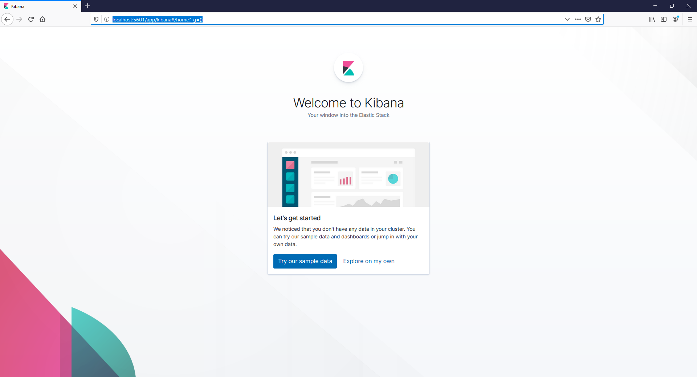
When you see that Kibana loaded successfully, you can start using the framework, which can be accessed at

```
localhost:4000
```
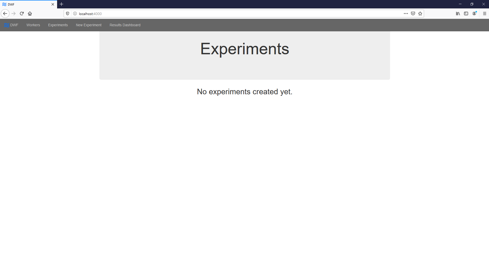

Now you have a running instance of the master node of DWF, to have your learn tasks processed you have to start at least one worker node.

### Running the worker

The worker can be started with the Python script located in the DWF-client folder, called dwf_client.py. Run it with the following command:

```
python DWF-client/dwf_client.py
```

To run multiple clients on a machine, you have to duplicate the DWF-client directory for each one of instances.

Now you have a fully working DWF framework.

## Preparing the dataset

Hence the input of the machine learning part of the framework has to be a csv file, which contains only numeric data, we have to implement our feature assembler or we have to use a dataset that is in the required format. Now we are going to use a public dataset called [Heart Disease Data Set](https://archive.ics.uci.edu/ml/datasets/Heart+Disease).

### Download the data file

You can download the .data file here: [reprocessed.hungarian.data](https://archive.ics.uci.edu/ml/machine-learning-databases/heart-disease/reprocessed.hungarian.data).

### Reformat the data file

Replace spaces with commas in the file (e.g. with Ctrl+H in Notepad++) to convert it into csv format. Maybe the last row in your csv file will contain a few empty commas after this process, if that's the case for you, delete this empty row:

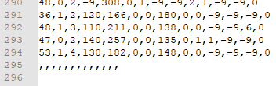

Add header row to the file, name the columns anything you like, here is an example:

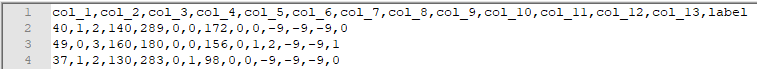

Save the file and move it to the network storage, that you previously set up in the running script.

## Use the framework

As the first step of using our framework you have to create a new Experiment.

### Create an Experiment

Open localhost:4000 in a browser, then select New Experiment from the menu at the top of the page.

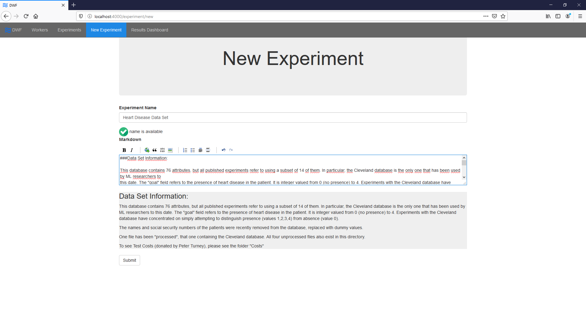

Give your experiment a name and fill the Markdown field with some description about it. Then click Submit.

### Configure a feature assembling method

As we mentioned earlier, the learning phase of the tasks require a csv file with only numeric data. The way you provide this file may vary depending on your goals. Now we will use our previously "preprocessed" file. To do so, click on "add feature assembling config".

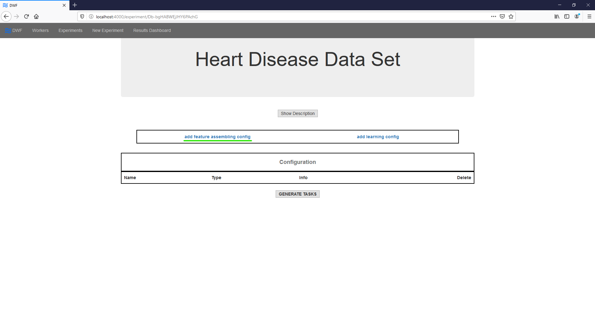

On the next screen select Manual File Input as strategy, browse the file you prepared previously, and fill in the Label column field with the name of the column that you want to predict on, in our case its "label".

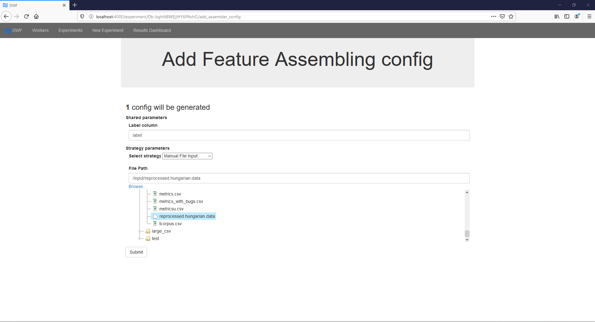

Then click Submit.

### Configure a learning algorithm

If you are not familiar with machine learning, or just want to get some results as fast as possible we recommend you to use the Random Forest Classifier. First, click on "add learning config".

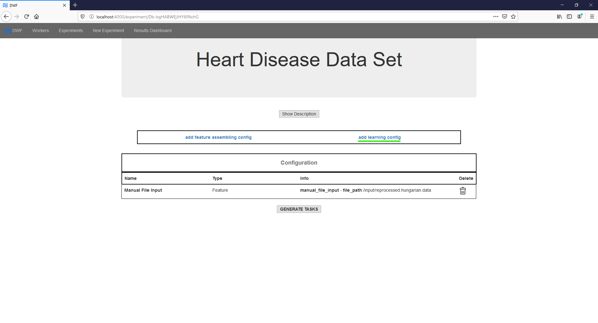

Select Random Forest Classifier from the strategy selector dropdown menu.

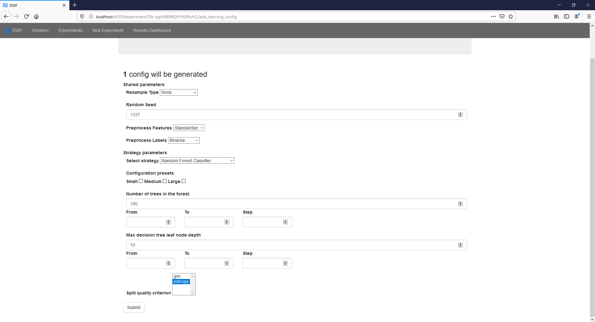

Then click Submit.

### Generate tasks

In the current state of the Experiment you can add or remove configurations. To run the tasks you have to finalize it's setup. Click on Generate Tasks button.

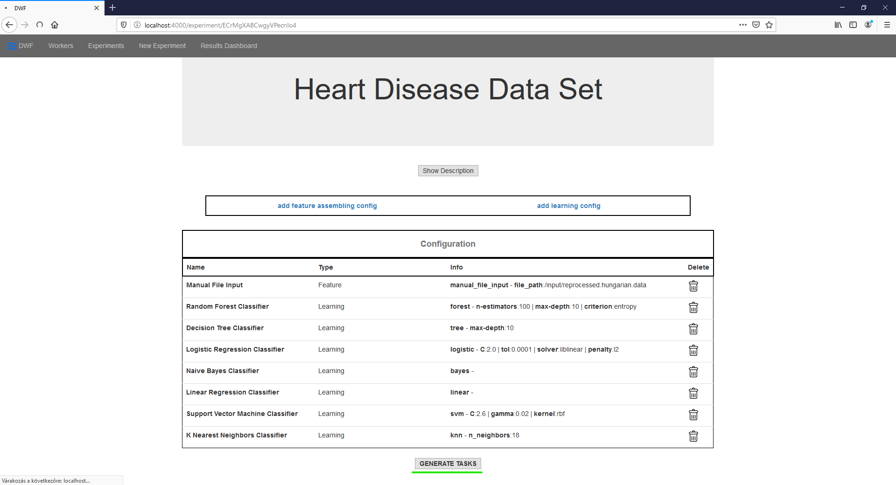

### Run tasks

Your generated tasks are in generated state yet. You can select what you want to run first, by clicking on the Play button next to the selected task, or you can start all task at once with the Run all button.

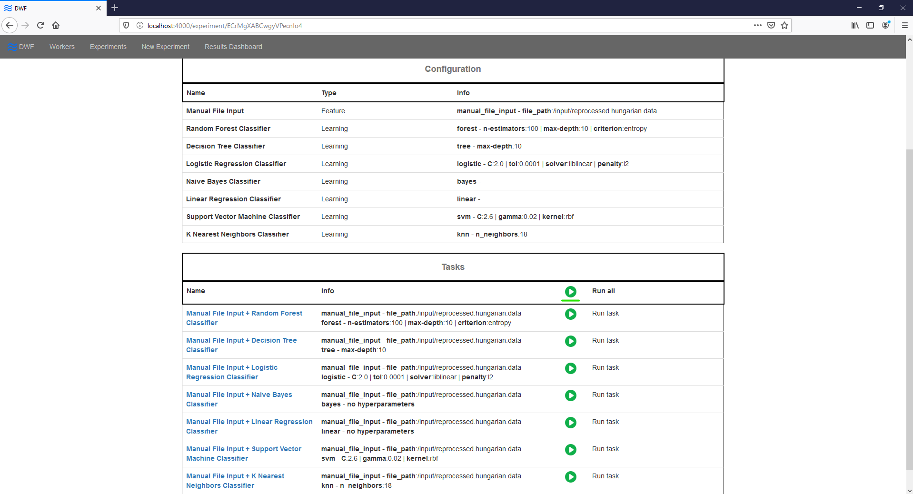

Soon one of your worker machines is going to check in for the task. You can check the state of all your tasks in the Tasks table.

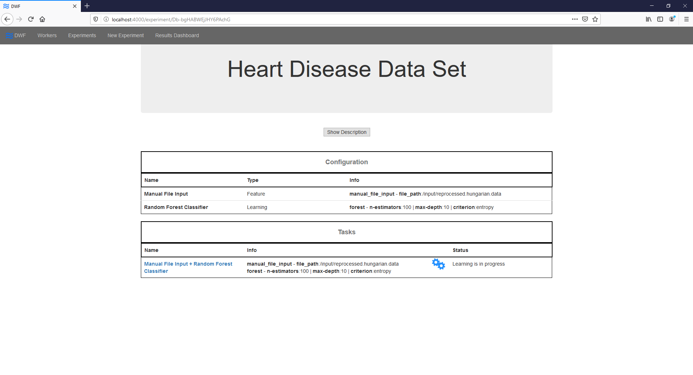

### Check the results

Once the worker finishes the process of a task, it's results being saved in the framework's database. You can compare the results of multiple tasks by clicking on Summary.

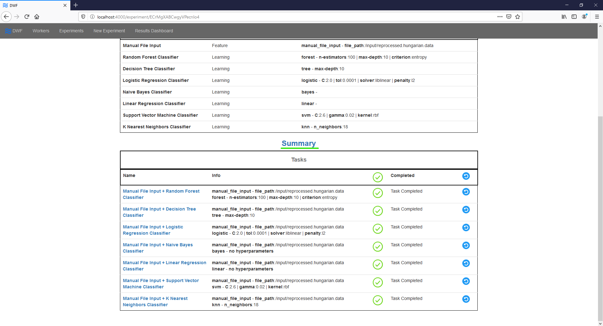

The best results in any column is marked with green background. Also you can order the results by clicking on the name of the specific columns.

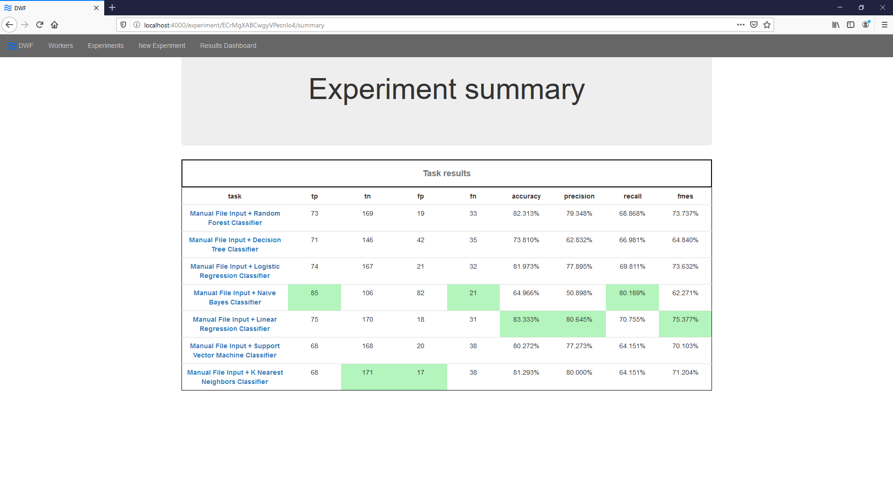
