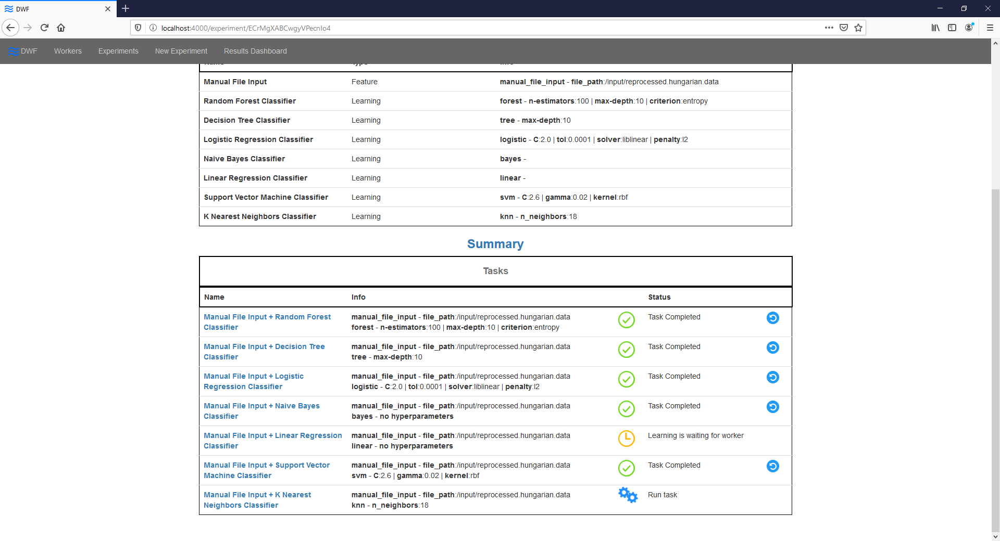

# Step By Step DWF guide

This guide will walk you through the most common features of the Deep-Water framework.

## Getting Started

These instructions will get you a copy of the project up and running on your local machine for research and/or testing purposes.

### Prerequisites

As the framework runs in a docker container, you have to install it first.

```
https://docs.docker.com/install/
```

To run the workers you have to install Python 3.

```
https://www.python.org/downloads/
```

### Running the server

At startup, you need to provide the connection info of a SAMBA network storage that will be used as a shared storage between the server and the workers. You can enter the connection info into the DWF-server/build_and_run.bat file (or the .sh version if you are using Linux). Edit the following environment variables in the script:

```
set SMB_VOL=//1.2.3.4/your/path/to/Deep-Water
set SMB_DOMAIN=your_samba_domain_name
```

The script needs the Dockerfile that can be found in the DWF-server directory, so start the script from that folder.

### Wait for the database starting up

After the script executed successfully, you have to wait for the database to get ready. You can check it by visiting

```
localhost:5601
```

When you see that Kibana loaded successfully, you can start using the framework, which can be accessed at

```
localhost:4000
```


Now you have a running instance of the master node of DWF; to have your learn tasks processed you have to start at least one worker node.

### Running the worker

The worker can be started with the Python script located in the DWF-client folder, called dwf_client.py. Run it with the following command:

```
python DWF-client/dwf_client.py
```

When the client connects to the server, it receives a unique ID, as you can see it in the clients' console log.


This hash code identifies the worker, and is also visible in the Workers view. There you can check the connected workers and their statuses.


To run multiple clients from the same machine, you have to copy the DWF-client directory for each worker instances, otherwise they will conflict. Nonetheless, in the typical scenario only one worker runs in a single machine and you can add multiple machines with running workers to the same server.

Having the server and at least one worker running, you have a fully functional DWF framework.

## Preparing the dataset

We are going to demonstrate the usage of DWF on a public dataset from the [UCI Machine Learning Repository](https://archive.ics.uci.edu/ml/datasets.php), called [Heart Disease Data Set](https://archive.ics.uci.edu/ml/datasets/Heart+Disease).

The input data for the machine learning part of the framework has to be in a csv formatted file, which contains only numeric values as data and a header row. Therefore, we have to use a dataset that is in the required format or we can implement a new feature assembler plugin to process the data source easily.
However, implementing a custom feature assembler is out of the scope for this tutorial.

### Download the data file

First, download the .data file from here: [reprocessed.hungarian.data](https://archive.ics.uci.edu/ml/machine-learning-databases/heart-disease/reprocessed.hungarian.data).

### Reformat the data file

To convert the downloaded file to a proper csv file, replace all spaces with commas in it (e.g. with Ctrl+H in Notepad++). The last row in the csv file may contain a few empty commas after the process, if that is the case, delete this empty row:


Add a header row to the file, and name the columns anything you like. Here is an example:


Save the file and move it to the network storage (Samba share) that you previously set up in the starting script.

## Use the framework

In the first step, you have to create a new _Experiment_.

### Create an Experiment

Open localhost:4000 in a browser, then select _New Experiment_ from the menu at the top of the page.


Give your experiment a name and fill the Markdown field with some description of it. Then click _Submit_.

### Configure a feature assembling method

As we mentioned above, the learning phase of the tasks accepts csv formatted files with only numeric values as data.

Here comes the option that you can implement your own feature assembler into play. If you have lots of files in the same format, like images, text documents or data with nominal features, you might want to implement a custom feature assembling method, which can process and convert your data into the required format automatically.

Now we will use the built-in _Manual file input_ with our previously "preprocessed" file. To do so, click on _add feature assembling config_.


Then select _Manual File Input_ as the strategy, which means that the training data will be produced by simply loading it from the selected csv file. If you extend the functionality of the framework, you will find your own feature assembling methods here.

Browse the file you prepared previously, and fill in the _Label column_ field with the column name that you want to predict (the class labels in the csv file).

If you named the columns according to the tutorial, it is going to be called "label".


Now click Submit.

### Configure a learning algorithm

Because the tutorial dataset consists of only a few hundreds of rows, using deep neural networks would have a limited use, thus we are going to employ some other algorithms in this tutorial.

First, click on _add learning config_.


Here you can add a learning strategy with parameters or parameter sets.
The framework provides you some default values to the required parameters for each algorithm, but you can change them any time.

As our first algorithm, select _Random Forest Classifier_ from the strategy selector dropdown menu.


Then click Submit.

You can add multiple Classifier algorithms in the same way. Here are some examples:


### Generate tasks

In the current state of the Experiment you can add or remove configurations. To run the tasks you have to finalize the setup.
Once you done that, no modifications are allowed.

Click on the _Generate Tasks_ button.


### Run tasks

Your tasks are generated, which means all the possible feature assembling and learning combinations are prepared and they can be run now. You can select what task you want to run first by clicking on the _Play_ button next to the selected task, or you can start all task at once with the _Run all_ button. Note that the server will assign these task to running workers and if you have only one of them, the execution of tasks will be sequential.


You can check the state of your tasks in the _Tasks_ table.



### Check the results

Once the worker finishes the processing of a task, its results will be saved in the framework's database. You can compare the results of multiple tasks by clicking on the _Summary_ link.


Here you can see the results of all learning algorithms with achieved performance measures, making it easy to compare them.

The best results in any column is marked with green background.

You can order the results by clicking on the name of the specific columns.


Clicking on the name of a specific task will navigate you to the _Task Details_ page, where you can see the details of the learning tasks, i.e. its parameters.


